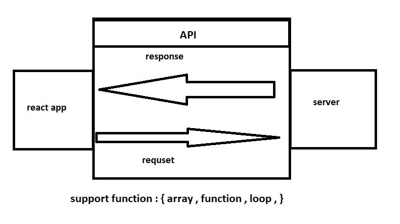

# city-explorer

**Author**: sultan elayan
**Version**: 1.0.0 (increment the patch/fix version number if you make more commits past your first submission)

## Overview
<!-- Provide a high level overview of what this application is and why you are building it, beyond the fact that it's an assignment for this class. (i.e. What's your problem domain?) -->

### we make this project to give the client the chance to explore the world and give them the requirement that they want it from location 

## Getting Started
<!-- What are the steps that a user must take in order to build this app on their own machine and get it running? -->

- build repo 
- build react app
- adding the api 
- lunching the app 

## Architecture
<!-- Provide a detailed description of the application design. What technologies (languages, libraries, etc) you're using, and any other relevant design information. -->

1. make the md file include ( wire frame + description  )
2. build the repo using GitHub 
3. build react using window terminal 
4. using notes using trello 
5. using API location 

## Change Log
<!-- Use this area to document the iterative changes made to your application as each feature is successfully implemented. Use time stamps. Here's an example:

27-6-2021 3:45 - made first step of building the app

01-01-2001 4:59pm - Application now has a fully-functional express server, with a GET route for the location resource. -->

## Credit and Collaborations
<!-- Give credit (and a link) to other people or resources that helped you build this application. -->

Name of feature: Asynchronous code, and APIs

Estimate of time needed to complete: 4 hours 

Start time: 3 PM

Finish time: 

Actual time needed to complete: _____
